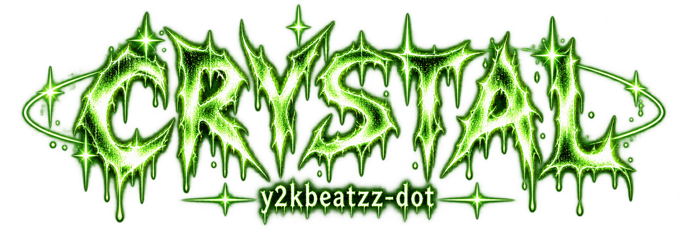
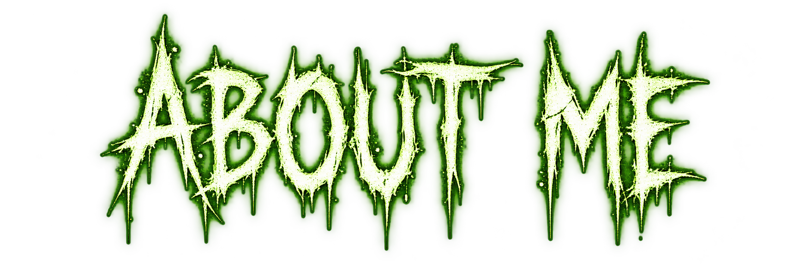
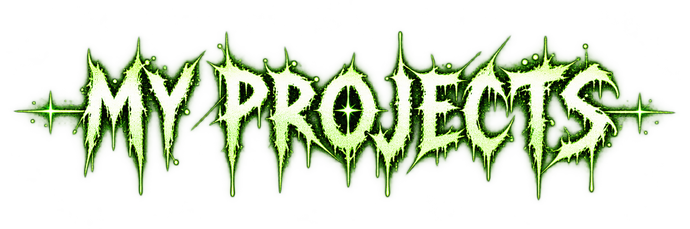
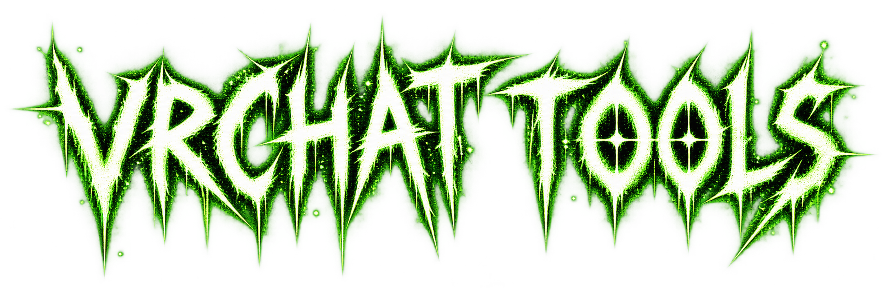
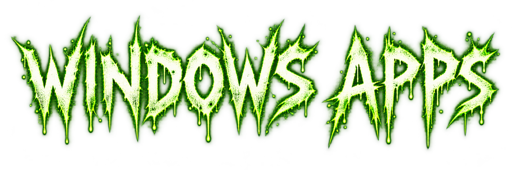
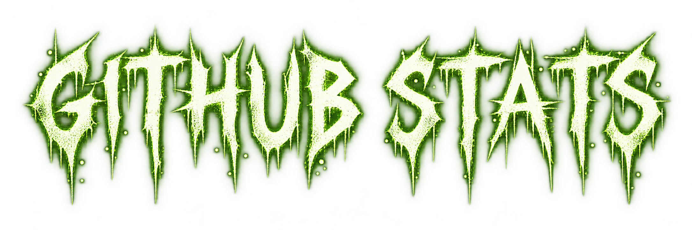
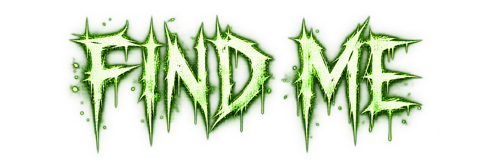

<div align="center">
  

  <br>

  
  
  

  <br><br>

  <b>she/her • Windows app developer • VRChat creator tools • UI experiments</b>
</div>

<br>

<div align="center">
  
</div>

```txt
name      : Crystal / Nitta Hoshi
username  : y2kbeatzz-dot
pronouns  : she/her
focus     : Windows apps • VRChat • UI/UX • music tools • modding
vibe      : dark • Y2K • neon • horror • custom interfaces
```

I build tools and apps that I wish already existed.

Most of my projects are focused on **custom Windows software**, **VRChat creator utilities**, **music/media apps**, **launchers**, **browser customization**, and other experiments with custom UI.

I like making software feel personal instead of looking like a default template.

<br>

<div align="center">
  
</div>

### 🏷️ VRChat Avatar Tagger

Bulk-apply VRChat Content Warning tags to avatars from the command line.

[](https://github.com/y2kbeatzz-dot/vrchat-avatar-tagger)

### 🌑 After The High

A custom web project with a darker visual style.

[](https://github.com/y2kbeatzz-dot/After-The-High)

### 🎵 Music + Media Experiments

I also build and experiment with:

- custom Windows music players
- synced lyrics
- animated album artwork
- audio-reactive visualizers
- Windows media integrations
- Spotify / Apple Music experiments
- desktop media widgets

<br>

<div align="center">
  
</div>

- avatar utilities
- Unity workflow tools
- creator automation
- avatar tagging systems
- custom avatar / UI experiments

<br>

<div align="center">
  
</div>

Some of the stuff I like building:

```yaml
apps:
  - desktop launchers
  - music players
  - media widgets
  - visualizers
  - browser customizers
  - game launchers
  - automation tools

style:
  - dark UI
  - neon green
  - Y2K
  - horror / grunge
  - animated interfaces
```

<br>

## ⚙️ Tech I Use

<div align="center">
  
</div>

<br>

<div align="center">
  
</div>

<div align="center">
  
  
</div>

<br>

<div align="center">
  

  <br>

  <a href="https://github.com/y2kbeatzz-dot">
    
  </a>
  <a href="https://guns.lol/life999">
    
  </a>

  <br><br>

  <code>build it • break it • fix it • make it look cool</code>
</div>
