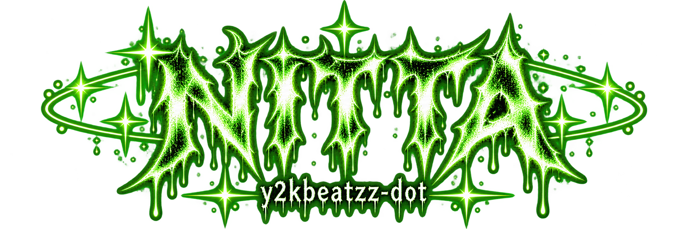

<div align="center">
  <a href="https://github.com/y2kbeatzz-dot">
    
  </a>

  <br>

  <a href="https://github.com/y2kbeatzz-dot">
    
  </a>
  <a href="https://github.com/y2kbeatzz-dot?tab=followers">
    
  </a>
  <a href="https://github.com/y2kbeatzz-dot?tab=repositories">
    
  </a>

  <br><br>

  <b>she/her • Windows app developer • VRChat creator tools • UI experiments</b>
</div>

<br>

<div align="center">
  
</div>

```txt
name      : Crystal / Nitta Hoshi
username  : y2kbeatzz-dot
pronouns  : she/her
focus     : Windows apps • VRChat • UI/UX • music tools • modding
vibe      : dark • Y2K • neon • horror • custom interfaces
```

I build tools and apps that I wish already existed.

Most of my projects are focused on **custom Windows software**, **VRChat creator utilities**, **music/media apps**, **launchers**, **browser customization**, and other experiments with custom UI.

I like making software feel personal instead of looking like a default template.

<br>

<div align="center">
  <a href="https://github.com/y2kbeatzz-dot?tab=repositories">
    
  </a>
</div>

### 🏷️ VRChat Avatar Tagger

Bulk-apply VRChat Content Warning tags to avatars from the command line.

[](https://github.com/y2kbeatzz-dot/vrchat-avatar-tagger)

### 🌑 After The High

A custom web project with a darker visual style.

[](https://github.com/y2kbeatzz-dot/After-The-High)

### 💜 Crystal GIF PFP for YouTube

Animated profile pictures that stay applied while browsing YouTube, with a purple interface and optional verified community sharing. **The shared service is online and the download is connected—no server setup needed.** Shared GIFs are visible to other extension users. Available as a preview while live sharing is being tested.

[](https://github.com/y2kbeatzz-dot/crystal-gif-pfp/archive/refs/heads/main.zip)
[](https://github.com/y2kbeatzz-dot/crystal-gif-pfp)

### 🎵 Music + Media Experiments

I also build and experiment with:

- custom Windows music players
- synced lyrics
- animated album artwork
- audio-reactive visualizers
- Windows media integrations
- Spotify / Apple Music experiments
- desktop media widgets

<br>

<div align="center">
  <a href="https://github.com/y2kbeatzz-dot/vrchat-avatar-tagger">
    
  </a>
</div>

- avatar utilities
- Unity workflow tools
- creator automation
- avatar tagging systems
- custom avatar / UI experiments

<br>

<div align="center">
  <a href="https://github.com/y2kbeatzz-dot?tab=repositories">
    
  </a>
</div>

Some of the stuff I like building:

```yaml
apps:
  - desktop launchers
  - music players
  - media widgets
  - visualizers
  - browser customizers
  - game launchers
  - automation tools

style:
  - dark UI
  - neon green
  - Y2K
  - horror / grunge
  - animated interfaces
```

<br>

## ⚙️ Tech I Use

<div align="center">
  <a href="https://developer.mozilla.org/en-US/docs/Web/HTML"></a>
  <a href="https://developer.mozilla.org/en-US/docs/Web/CSS"></a>
  <a href="https://developer.mozilla.org/en-US/docs/Web/JavaScript"></a>
  <a href="https://nodejs.org/"></a>
  <a href="https://learn.microsoft.com/dotnet/csharp/"></a>
  <a href="https://dotnet.microsoft.com/"></a>
  <a href="https://www.python.org/"></a>
  <a href="https://learn.microsoft.com/powershell/"></a>
  <a href="https://www.electronjs.org/"></a>
  <a href="https://git-scm.com/"></a>
  <a href="https://github.com/y2kbeatzz-dot"></a>
  <a href="https://code.visualstudio.com/"></a>
  <a href="https://visualstudio.microsoft.com/"></a>
  <a href="https://unity.com/"></a>
  <a href="https://www.linux.org/"></a>
  <a href="https://archlinux.org/"></a>
</div>

<br>

<div align="center">
  <a href="https://github.com/y2kbeatzz-dot">
    
  </a>
</div>

<div align="center">
  <a href="https://github.com/y2kbeatzz-dot">
    
  </a>
  <a href="https://github.com/y2kbeatzz-dot?tab=repositories">
    
  </a>

  <br>

  <a href="https://github.com/y2kbeatzz-dot">
    
  </a>
</div>

<br>

<div align="center">
  

  <br>

  <a href="https://github.com/y2kbeatzz-dot">
    
  </a>
  <a href="https://guns.lol/life999">
    
  </a>

  <br><br>

  <code>build it • break it • fix it • make it look cool</code>
</div>
