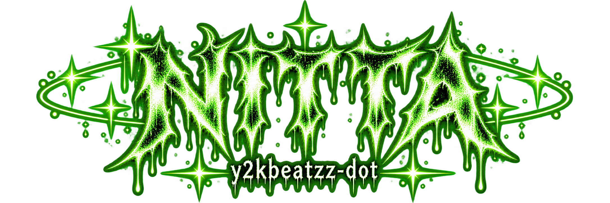

# hey, I'm Crystal ✦

**Nitta Hoshi · she/her · y2kbeatzz-dot**

I build tools I wish already existed. 
Apps, VRChat creator tools, personal interfaces, and projects that help people connect.

---

### A little about me

Windows is my main workspace, Unity is where I work on VRChat projects, and I’m always learning something new. I like dark interfaces, Y2K details, music, and making everyday software feel more personal.

My projects range from mobile communication apps to desktop experiments and awareness websites. Some are practical, some are cozy, and some start with “why doesn’t this exist already?”

### In the spotlight

<table>
<tr>
<td width="50%" valign="top">

#### 💬 CrystalTalk
**Your words. Your way.**

A free VRChat communication companion for iPhone, iPad, and Android. Send phrase buttons or typed messages to the chatbox through OSC.

Made with nonverbal people in mind, and for anyone who prefers not to use their mic.

[Website & downloads](https://y2kbeatzz-dot.github.io/crystaltalk/) · [Repository](https://github.com/y2kbeatzz-dot/crystaltalk)

</td>
<td width="50%" valign="top">

#### 🛠️ Crystal VRC Toolkit
**Less searching. More creating.**

A Unity workspace bringing VRChat avatar and world resources together: a searchable tool hub, material and blendshape editing, project checks, and quick actions.

Distributed through VCC / ALCOM.

[Install & guide](https://github.com/y2kbeatzz-dot/crystal-vrc-toolkit#readme) · [Repository](https://github.com/y2kbeatzz-dot/crystal-vrc-toolkit)

</td>
</tr>
<tr>
<td width="50%" valign="top">

#### 🌑 After The High
**Awareness, recovery, and remembrance.**

A drug-awareness project bringing overdose prevention, recovery information, music, remembrance, and help resources together.

[Visit the site](https://y2kbeatzz-dot.github.io/After-The-High/) · [Repository](https://github.com/y2kbeatzz-dot/After-The-High)

</td>
<td width="50%" valign="top">

#### 💜 Through Every Season
**A space for coping and connection.**

A self-harm and suicide awareness website with coping ideas, support resources, optional music, and seasonal themes.

[Visit the site](https://y2kbeatzz-dot.github.io/Through-Every-Season/) · [Repository](https://github.com/y2kbeatzz-dot/Through-Every-Season)

</td>
</tr>
</table>

### More from my corner of GitHub

| Project | What it’s for |
| :--- | :--- |
| [VRChat Avatar Tagger](https://github.com/y2kbeatzz-dot/vrchat-avatar-tagger) | Bulk-apply VRChat Content Warning tags from the command line. |
| [Crystal GIF PFP](https://github.com/y2kbeatzz-dot/crystal-gif-pfp) | A browser extension for animated profile pictures on YouTube. |

### What I like working on

- **VRChat & Unity:** avatar utilities, creator workflows, OSC, and custom interfaces.
- **Desktop & browser:** Windows apps, launchers, wallpaper customization, and UI experiments.
- **Music & media:** players, lyrics, visualizers, animated artwork, and media widgets.
- **Mobile:** communication tools and small personal apps for phones and tablets.

### My toolbox

Languages and tools I use and keep learning:

  

 

<b>A peek at my GitHub activity</b>

 

---

**build it · break it · fix it · make it feel like me**

[GitHub](https://github.com/y2kbeatzz-dot) · [guns.lol](https://guns.lol/life999)

